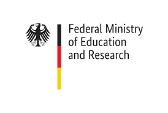

The "H2Global meets Africa" research project is investigating **potentials and measures for a sustainable hydrogen and PtX ramp-up in Africa.** The project is being coordinated by the Ostbayerische Technische Hochschule (OTH) Regensburg and is being carried out under the leadership of Prof. Dr.-Ing. Michael Sterner at the Research Center for Energy Networks and Energy Storage (FENES). Other project partners are the Fraunhofer Institute for Energy Economics and Energy System Technology Kassel (IEE) and the H2Global Foundation. The research project will run for 36 months, **starting on 01.01.2023 and ending on 31.12.2025**. The funding amounts to approx. **4.2 million euros.**

In order to achieve national and international **climate protection targets** and to **diversify** the energy supply in Germany and Europe and make it more **secure**, it is crucial to ramp up the **hydrogen economy** both nationally and internationally. Two things are important for this ramp-up: stable international **partnerships** and a stable legal and **financial framework.**

The aim of the research project is to enable African partner countries to enter the global hydrogen economy. For this, a comprehensive **transfer of knowledge** is taking place and specific H2/PtX value and supply chains between Africa and Europe/Germany are being evaluated (see Fig. 1). The transformation of the energy systems in Europe, Germany and Africa will be considered in an integrated manner through **coupled energy system modeling** in order to identify common transformation paths and potentials. In addition, the project will develop measures to promote the market ramp-up of hydrogen in Africa, such as a catalog of criteria and **financing instruments.** Key project results and models will be made available as **open source / open data** and will contribute to promoting the hydrogen sector in Africa and strengthening cooperation between Europe and Africa.
